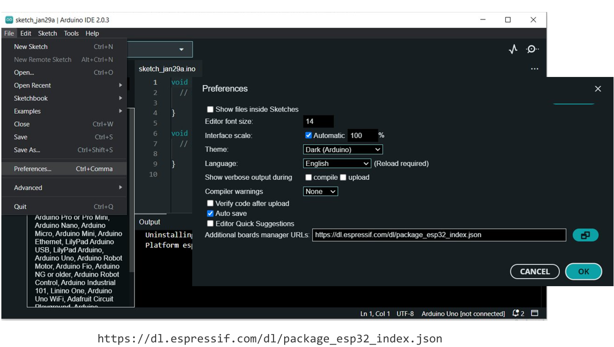
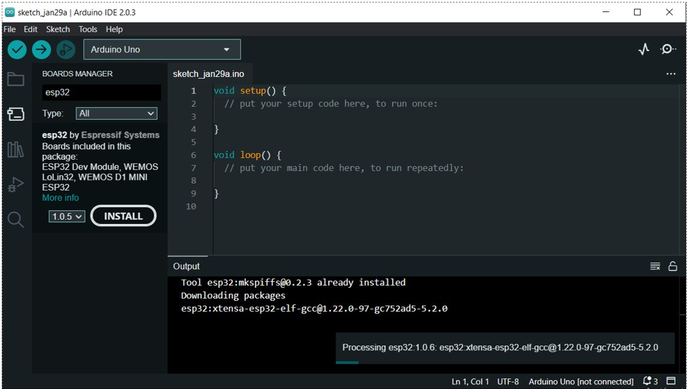

# Installation and pre-requisites

It is highly advisable that if you are using Windows, you should consider creating a Virtual Machine for the course.

## Arduino IDE

Arduino IDE is the primary IDE for Arduino MCUs. The IDE also provides support for a lot of other non-Arduino boards as well, with the same consistent environment across all the boards.

HOW-TO-USE: Just follow the procedure step by step, don't open all the links at once, take it easy.

**Download (macOS and Windows):** [https://www.arduino.cc/en/software]()

Please choose the appropriate download file from the *Download Options* of "Arduino IDE 2.3.2".

**Installation (macOS and Windows):** [https://docs.arduino.cc/software/ide-v2/tutorials/getting-started/ide-v2-downloading-and-installing/]()

The installation guide from the docs provides an excellent tutorial on how to get your IDE configured correctly.

*For Linux Users Only:* You can install the IDE Appimage by using the following commands:

```shell
$ sudo add-apt-repository universe
$ sudo apt update
$ sudo apt install libfuse2  # libfc is a dependency
# download the appimage. assuming the file is downloaded as /tmp/arduino.
$ sudo chmod +x /tmp/arduino  # make the appimage executable
$ mv /tmp/arduino /usr/local/bin
$ arduino       # assuming /usr/local/bin is on the PATH. IDE should be launched
```

Make sure correct permissions are allowed. The currently logged user should have read and write access to the serial port over USB. On most Linux distributions, this is done by adding the user to `dialout` group with the following command:

```shell
$ sudo usermod -a -G dialout $USER
```

on Arch Linux this can be done by adding the user to uucp  group with the following command:

```shell
$ sudo usermod -a -G uucp $USER
```

Make sure you re-login to enable read and write permissions for the serial port, since the changes are made before login.

Enable support for ESP32 in arduino IDE by navigating to "(Toolbar) *File->Preferences*" inside the Arduino IDE, and then paste the following link in the "Additional boards manager URLs".

```
https://dl.espressif.com/dl/package_esp32_index.json
```

The rest of the instructions can be found [here](https://github.com/espressif/vscode-esp-idf-extension/blob/master/docs/tutorial/install.md) (starting from 2) to install the framework. This way the whole ESP-idf suite gets installed with the extension (which you also might have from your Arduino ESP32 installation, unless you have provided the explicit path to the framework). But, you will be able to do native ESP development from VSCode after all the hassle.




## Espressif IDF

Installing the Espressif IDF (ESP-IDF) is convenient since you just need to install a VS Code extension called "ESP-IDF" from Espressif Systems.

*NOTE FOR LINUX AND MAC USERS: You need to satisfy the dependencies first by installing the following packages.*

Linux (Ubuntu):

```shell
$ sudo apt-get install git wget flex bison gperf python3 python3-pip python3-venv cmake ninja-build ccache libffi-dev libssl-dev dfu-util libusb-1.0-0
```

Linux (Arch):

```shell
$ sudo pacman -S --needed gcc git make flex bison gperf python cmake ninja ccache dfu-util libusb
```

MacOS:

Make sure you have Apple Rosetta 2 installed and enabled (if M1 chip).

```shell
$ brew install ccache cmake ninja dfu-util
```

## OPTIONAL:

If you are super comfortable with VSCode, and don't want to shift to the Arduino IDE, then there's another option called "PlatformIO". It provides an Arduino like framework for a majority of MCUs, and integrates well with VSCode. Find out more about PlatformIO  at [https://docs.platformio.org/en/latest/what-is-platformio.html]().
